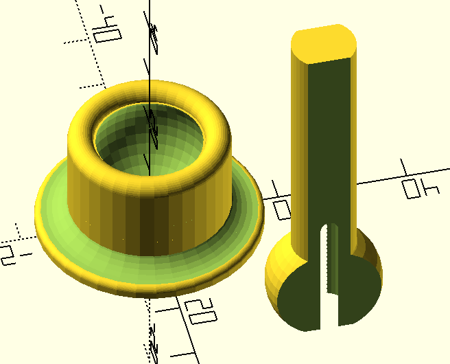

# Keyboard Support Platform and Peg

Made quick to illustrate possible platform for keyboard support. OpenSCAD file is parameterized, but likely won't work too well.

Print base with wide platform on build plate. Print peg with long axis (that goes through sphere) parallel to build plate.

Preview surface and wireframe images are in this dir, along with openscad and stl files.

## TODO

* print objects to test that wall thickness is good and doesn't break when inserting into void
* test if jointVerticalCoverageFraction of 0.75 is good, or if that is too small an opening for peg. Change or cut away from top edge torus to make a larger opening
* fix peg shaft magic number - currently 10mm and platform width is 35mm. Changing platform width messes up peg shaft and sphere joint. simple (platform width)/3 doesn't work. tired fix later.
* include threading on peg shaft
* test sphere joint separation. Currently 0.5mm which is probably too much to hold palm rest in place with sphere friction?
* set good shaft height
* learn clojure
